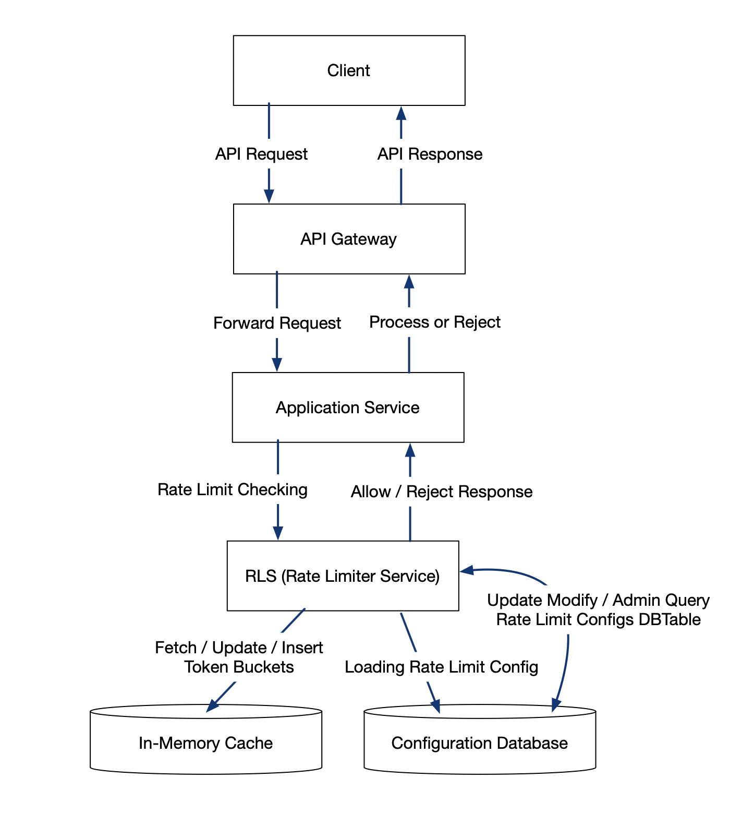

# Rate Limiter 

## Architecture Diagrams 


## Request Flow Sequence 

## API & UML Diagram 


## Database Tables / Schemas 

--- 

# Fun. / No-Fun. Requirements 

## Functional Requirements 
- The system should limit the number of requests a user can make to specific API within a define time window (e.g., 100 requests per minute per user per API).
- The rate limit configuration should be per user per API endpoint for simplicity.
- If a user exceeds the allowed rate, further requests should be rejected until the window resets. 
- The system should provide an API to check if a request is allowed and, if not, indicate when the user can retry.
- The rate limiting algorithm should allow for short bursts (e.g., using a token bucket algorithm).

## Non-Functional Requirements 
- The system should be highly available and reliable, as it is on the critical path of request processing. 
- The response time for rate limit checks should be low (target < 10 ms per request).
- The system should be horizontally scalable to handle high request volumes (e.g., millions of requests per second).
- The system should be easy to configure and maintain 
- The system should be resilient to failures, such as server crashes or cache outages. 

--- 

# Traffic Estimation and Data Calculation 
## Traffic Estimation 
- Assume the system needs to support 500,000 requests per second at peak load. 
- Assume 500,000 active users.
- Each user may access up to 10 different APIs, so up to 5 million (500,000 users * 10 APIs) unique rate limit buckets. 

## Data Calculation 
- Each rate limit buckets stores: user_id, api_id, current token count, last updated timestamp. Estimate ~32 bytes per bucket. 
- Total memory needed for buckets: 5 million * 32 bytes = 160 MB (fits easily in memory or cache)
- Rate limit configuration (e.g., max requests per minute) is small and can be stored in a database; assume 1 KB per API, so for 10 APIs: 10KB. 
- Expected cache read/write operations up to 500,000 per second( one per request).
- The system should be designed to handle occasional bursts, so peak traffic may be 2 * the average (up to 1 million RPS for short periods).


---

# API Design 
## Check Rate Limit 
- **Endpoint**: `POST /rate_limit/check`
- **Request Body**
```json 
{
    "user_id": "string",
    "api_id": "string"
}
```

- **Response Body**:
__rate_limter_allowed__

```json 
{
    "allowed": true
}
```

__rate_limiter_not_allowed__

```json 
{
    "allowed": false,
    "retry_after_seconds": 12
}
```

## Set Rate Limit Configuration (admin config center)
- Endpoint: `POST /rate_limit/configure`
- Request Body 
```
{
    "api_id": "string",
    "max_requests_per_minute": 100
}
```

- Response
```
{
    "success": true 
}
```

### Notes 
- The main API for runtime checks is `/rate_limit/check`, which is called by the application before processing a request. 
- The configuration API is optional and used for setting or updating rate limits per API. 

---

# Database Design 
## Rate Limit Configuration Table 
**Table Name**: rate_limit_config 
**Columns**:
- `api_id`: (string:PK)
- `max_requests_per_minute`: (integer)
- `created_at`: (timestamp)
- `updated_at`: (timestamp)

## Token Bucket State (Stored in Cache, not DB)
- Key: 
`user_id:api_id`: string

- Value
`current_tokens`: integer 
`last_refill_timestamp`: timestamp

### Notes: 
- The `rate_limit_config` table is stored in a relational database for persistence and configuration management. 
- The token bucket state is stored in a in-memory cache(e.g, Redis) for fast access and atomic updates. Each key represents a unique user and API combination. 

# High Level Architecture 
The high level architecture consists of the following components:


- **Clients**: (e.g., web or mobile apps) send API requests
- **API Gateway**: receives incoming requests and forwards them to the appropriate backend service. 
- **Application Services**: process business logic. Before handling a request, they call the Rate Limiting Service to check if the request is allowed 
- **Rate Limiting Service (RLS)**: is a stateless responsible for enforcing rate limits. It exposes an API for checking and configuring rate limits. 
- **In-Memory Cache (such as Redis)**: stores the current state of each user's rate limit bucket for fast, atomic access, and updates.
- **Database**: stores rate limit configurations (e.g., max requests per minute per API) for persistence and management.

---

# Detailed Components Design 
## Rate Limit Service (RLS)
- **Stateless HTTP service** that exposes APIs for checking and configuring rate limits. 
- On receiving a _check_ request, it:
  - Constructs a cache key using `user_id:api_id`
  - Fetches the token bucket state from the cache (e.g., Redis).
  - If the bucket does not exist, initialize it by using the configuration from the database. 
  - Calculates the number of tokens to refill based on the elapsed time since `last_refill_timestamp` and the configured rate.
  - If tokens are available, decrements the token count and allows the request. 
  - If no tokens are availble, denies the request and returns `retry_after_seconds`.
  - Updates the bucket state atomically int he cache (using Redis commands like `INCRBY` `DECR` or Lua scripts for atomicity).

## In-Memory Cache (Redis)
- Stores token buckets state for each `user_id:api_id` as a key.
- Each entry contains `current_tokens` and `last_refill_timestamp`.
- Supports atomic operations to avoid race conditions when multiple RLS instancesupdate the same bucket. 
- TTL (time to live) can be set on keys to automatically clean up inactive buckets. 

## Database 
- Stores persistent rate limit configuraitons for each API endpoints
- RLS loads configuration into memory or cache on startup and refreshes periodically or on configuration change. 
- Not used for real-time request checks, only for configuration recovery. 

## Application Service 
- Before processing an API request, call the RLS `/rate_limt/check` endpoint with the relevant `user_id` and `api_id`.
- If allowed, proceed with business logic; if denied, return an error to the client with `retry_after_seconds`.

## Configuration Management (__config center__)
- Admins can update rate limit settings via the configuration API.
- RLS listens for configuration changes and reloads setting as needed. 

## Concurrency and Consistency 
- All updates to token buckets in cache are performed atomically to prevent lost updates. 
- Multiple RLS instances can operate concurrently, as the cache ensures consistency. 

```
We use Redis as a centralized in-memory cache to store token buckets. Since updates need to be atomic to prevent lost tokens during concurrent access, Redis provides several native features to handle this. 
```

---

# Trade-Off Discussion 
## Token Bucket vs. Leaky Bucket Algorithm 

## Per-User-Per-API vs. Global Limits:

## In-Memory Cache (Redis) vs. Local Memory 

## Atomic Operations in Cache 

## Storing Buckets in Cache vs. Database

## Configuration Storage 

## TTL for Bucket Keys 

---

# Failure Scenario Discussion 
## Cache Service Outage: 
## Hot Key Problem:
- If the in-memory cache (e.g., Redis) becomes unavailable, the RLS cannot access or update token buckets, leading to all requests being either allowed (if failing open) or denied (if failing closed). This impacts rate limiting enforcement and could result in abuse or serivce disruption.
- Data in cache is volatile; if the cache restarts, all token bucket states are lost. Users may temporarily bypass rate limit until the buckets are rebuilt. 

## RLS Instance Failure:
- Since RLS instances are stateless, failure of one instance does not affect the overall system as long as others are available. However, if all RLS instances fail or are unreachable, no rate limiting checks can be performed. 

## Database Unavailability:
- If the configuration database is down, new or updated rate limit configurations cannot be loaded. Existing rate limits in memory or cache continue to function, but configuration changes are not possible until recovery. 

## Network Partitions 
- Network issues between RLS and cache or database can cause partial outages, leading to inconsistent rate limiting or inability to enforce limits for some users or APIs. 

## Clock Skew
- If RLS instance have unsynchronized clocks, token refill calculations may be inconsistent, resulting in incorrect rate limiting behavior. 