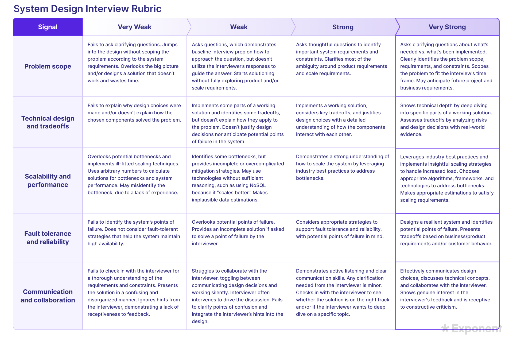

# System Design

## Introduction 
Most of the questions in this repo are derived form the [Exponent System Design Interview Course](https://www.tryexponent.com/courses/system-design-interviews?src=nav). 

For each question, the answer is based primarily on Exponent's video explanation. In addition, we add: 
- Interviewer's guiding questions (as heard or inferred from the video),
- Follow-up questions that should have been asked or answered.
- Key points that were missed by the interviewee but should be mentioned during a real system design interview.

There are a number of important concepts referenced throughout this repo. Most of them come from:
- Designing Data-Intensive Applications (DDIA).
- System Design Interview by Alex Xu,
- And the Exponent video course itself.

You'll also find notes about how interviewers evaluate candiates, such as the criteria for "weak hire", "strong hire", and so on -- these are especially helpful self-evaluation and identifying what to improve. 

We also provide scripts or structured answers to classic system design questions from Exponents, categorized by topic:

- Real-time System Design
- Media & Content Delivery
- Async & Data Processing
- Payments & Marketplace
- Distributed Infrastructure

These questions and answers form the base knowledge library -- they are the foundation of our system design preparation. As a beginner in this domain, I'll treat these as the minimum I need to master. 
Once I'm confident with these, I will start expanding ourward: using structured agendas, exploring variations of the same question, and practicing common English expressions used during interviews. 

Eventually, this base knowledge will help me answer more open-ended and FAANG-style system design questions -- but no matter how far I expand, I'll always com back to the base questions. They are the anchor of my learning. 

## How Well Did I Do in the System Design Round
This agenda outlines the major stages of a 45-minute system design interview. 

## [System Design Agenda & Time Allocation](./routine.md)

**Note:**  
This version of the system design agenda is based on my self-study, mainly through books and watching mock interview videos. I haven’t yet refined it through real mock interview practice. As I participate in more mock interviews on Exponent, I will revise and adapt the content to reflect practical feedback and lessons learned.

This agenda is designed for beginners. Once we're familiar with the overall system design flow, we can start emphasizing different parts based on the interviewer’s preferences and the context of the conversation.

**While everything in a system design interview can be flexible, it's important to start with a more standarized structure.**

- 0-5 min: Problem Clarification & Scoping 
- 5-10 min: Functional & Non-Functional Requirements 
- 10-15 min: API Design & Data Modeling 
- 15-20 min: Capacity Estimation 
- 20-30 min: High-Level Design + Component Breakdown 
- 30-35 min: Trade-offs & Reliability 
- 35-40 min: Scalability, Bottlenecks & Maintenance 
  _i prefer add some observability usage or solution here like adding jeager & prometheus & grafana etc._
- 40-45 min: Wrap-up, Evolution & Future Features 

