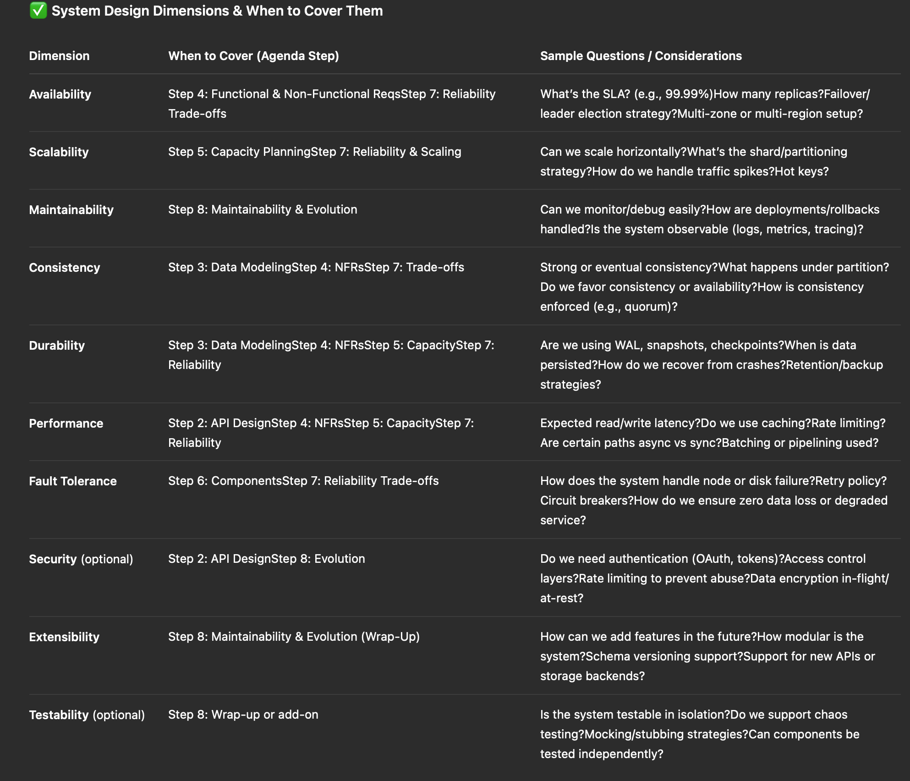
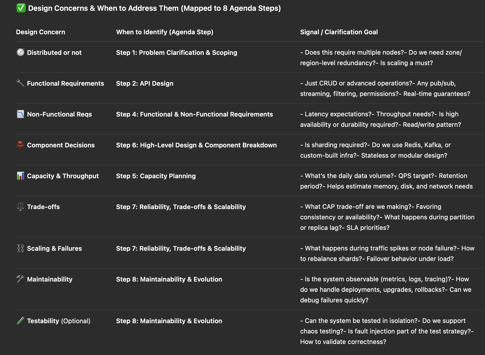

# General System Design Interview Agenda (Standard Verson for All Classic Problems)

⚠️ **Note:**  
This version of the system design agenda is based on my self-study, mainly through books and watching mock interview videos. I haven’t yet refined it through real mock interview practice. As I participate in more mock interviews on Exponent, I will revise and adapt the content to reflect practical feedback and lessons learned.

📌 This framework contains 8 core stages and applies to any system design problem. Each phase addresses:
- The main objective.
- What to clarify with the interviewer
- Signals for distributed vs. non-distributed, small vs. large system
- Whether this stage affects architecture decisions (e.g., CAP choices, persistence, data layering) 

## ✅ Step-1: Problem Clarification & Scoping 
### 🎯 Goal: Understand the business purpose, define boundaries, and avoid going off-track.
**Typical Questions**:
- Who are the end users ? Humans ? Machines ? IoT devices ? 
- What's the scale and usage pattern ? (B2C public system ? Internal tool ? CDN ?)
- What is the primary goal? Speed ? Safety ? High availability ? Low latency ? Massive scale ? 
- Is this a minimum viable product (MVP) or a full-brown internet-scale service ? 
- Does the system require advanced features like permissioning, batch operaitons, data export ? 

**Signals to Watch**:
- If the system involves cross-region deployment, high QPS, or large data volume -> tends towards distributed architecture. 
- If it's low-volume, stable traffic with tight latency -> monolithic or lightweight solution might suffice 

## ✅ Step-2: API Design 
### 🎯 Goal: Clearly define the interface for system usage and integration 

**Typical Questions**
- What are the core APIs ? 
- Is asynchronous behavior needed ? (e.g., Webhooks, Pub/Sub, event streams)
- Should responses be versioned ? Are APIs idempotent ? 
- Is authentication or rate limiting required ? 

**Singals to Watch**
This phase establishes I/O boundaries, which is essential for defining system modules and request flows. 

## ✅ Step-3: Data Modeling 
### 🎯 Goal: Identify core data entities and their relationships.
**Typical Tasks**: 
- Define main object models (e.g., User, Message, Product, File) also take consideration those objects relationships because we may be required to design SQL/No-SQL DB Tables around those objects. 
- Determine the fields and attributes (e.g., key, value, TTL, timestamps).
- Are we storing structured data or blobs/unstructured documents --> depends on the converstation context and interviewers' prefrences
- Is versioning or TTL needed ? 

**Signals to Watch**:
- If schema is fixed -> like relational DB
- If schema is dyanmic -> consider document stores (MongoDB, DynamoDB) -> features and trade offs of basic middleware we also need to know and prepare for this.

## ✅ Step-4: Functional & Non-Functional Requirements 
### 🎯 Goal: Identify the expected behavior and performance constraints.
**Common Topics**
- Functional needs: storing, retrieving, searching, subscribing, queue processing, etc.
- Non-Functional needs: latency, througput, reliability, SLAs
- Is presistence mandatory? Can the system tolerance data loss ?
- Is high availability a must ? What's the target SLA (99.9%, 99.99%) ? 

**Signals to Watch**:
- Questions listed above and their answers from interviewees give us the main scope and decisions of the coming phase,like : 
- CAP trade-offs, storage layers, deployment patterns, etc.

## ✅ Step-5: Capacity Planning 
### 🎯 Goal: Use rough estimates to determine system size and infrastructure needs. 
**Typical Extimation Quesitons:**
- Expected QPS (Query Per Second)?
- Daily data write/read volume ? 
- Average object size (e.g., text, image, file) ?
- Data retention period ? Is backup required ? 

This phase guides decisions about **sharding**, **tiered storage**, and **preemptive bottleneck detection**.

## ✅ Step-6: High-Level Design & Component Breakdown 
### 🎯 Goal: Describe key system components
**Common Components**
- API layer or Gateway 
- Dispatcher, Router, Load Balancer 
- Storage engine (DB, cache, file store, object store)
- Replication modules, message queues, search indexers, pub-sub
- Background workers, cron jobs, cleanup services

**Be sure to clarify**:
- Which components are stateless?
- Where is consistency guaranteed ? 
- Is the system single-master or multi-leader? How is traffic distributed ? 

## ✅ Step-7: Reliability, Trade-Offs, and Scalability 
### 🎯 Goal: Explore distributed challenges and the engineering trade-offs made.
**Typical Areas to Address:**
- Disaster recovery, replicas (multi-zone, multi-region, multi-master)
- CAP theorem: Are we prioritiezing Consistency, Availability, or Parittion Tolerance ? 
- Caching strategies: readh-through, write-through, hot key eviction ? 
- Failure handling: retries, circuit breakers, timeouts, idempotency 

This phase assesses whether we can make pragmatic decisions under trade-offs. 

## ✅ Step-8: Maintainability & Evolution 
### 🎯 Goal: Ensure the system is operable, extensible, and production-ready in the long term. 

**Common Questions**
- Can we do zero-downtime or rolling deployments ? 
- How do we handle schema migrations and backward compability ? 
- What monitoring tools are in place ? (metris, logs, traces)
- What is the debugging workflow ? How are errors surfaced ? 

## 🔁 Optional Topics: 
- Logging Infrastructure (e.g., ELK stack, Flink)
- Data pipelines (ETL, CDC)
- Multi-tenancy support (isolation and user specific limits)

--- 

# System Design Dimensions

--- 

# System Design Concern 
